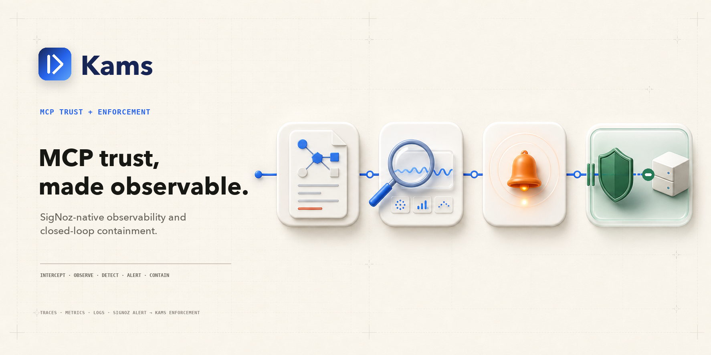

# Kams — Observable Trust and Closed-Loop Containment for MCP

> A transparent observability and control boundary for the **Model Context
> Protocol** — pinning the tool definitions your agents trust, emitting
> OpenTelemetry traces, metrics, and correlated logs to **SigNoz**, detecting
> dangerous drift and sensitive egress, and turning an alert into a TTL-bound
> quarantine before the next unsafe tool call reaches the server.

Built for **[Agents of SigNoz](https://www.wemakedevs.org/hackathons/signoz)** —
Track 01, AI & Agent Observability.

---

## Live

- 🎥 **Demo video** — https://youtu.be/Jzf-HQRsdmg
- 🌐 **Live demo** — https://usekams.xyz/
- 📖 **Docs** — https://docs.usekams.xyz/
- 🗺️ **Architecture** — https://docs.usekams.xyz/architecture

---

## Table of Contents

- [Quick Path](#quick-path)
- [Why It Stands Out](#why-it-stands-out)
- [What it does](#what-it-does)
- [Architecture](#architecture)
- [Requirements](#requirements)
- [Setup](#setup)
- [Usage](#usage)
- [Kams at the MCP boundary](#kams-at-the-mcp-boundary)
  - [Use Kams from any stdio MCP host](#use-kams-from-any-stdio-mcp-host)
  - [Streamable HTTP](#streamable-http)
  - [SigNoz-origin containment proof](#signoz-origin-containment-proof)
  - [Real Bedrock agent path](#real-bedrock-agent-path)
- [Project layout](#project-layout)
- [AI assistance](#ai-assistance)
- [License](#license)

---

## Quick Path

If you want the shortest path through the project:

```bash
./scripts/bootstrap.sh
uv sync
cp .env.example .env   # set SIGNOZ_API_KEY
uv run python scripts/provision.py
uv run python demo/scenario.py
uv run kams-demo-alert
```

The final command deliberately disables local reflex enforcement. It waits for
SigNoz to evaluate the critical alert and **fails** unless the resulting
restriction carries `origin=signoz` and the next MCP call is actually blocked.

For the docs site:

```bash
cd web
npm install
npm run dev
```

Then open `http://localhost:3000/docs`.

For the implementation details:

- Quickstart — https://docs.usekams.xyz/quickstart
- Interactive architecture — https://docs.usekams.xyz/architecture
- Implemented runtime design — [`architecture.md`](architecture.md)

## Why It Stands Out

Kams is strong for AI and agent observability because it does three things
together:

- **It treats MCP as an observable dependency boundary.** Kams emits published
  OpenTelemetry MCP spans, explicit-bucket metrics, and trace-correlated logs
  from both stdio and streamable HTTP without requiring agent SDK changes.
- **It measures trust instead of assuming it.** Kams fingerprints every tool's
  `(name, description, inputSchema)`, distinguishes provisional observation
  from an explicit human pin, and classifies the exact change when a server
  drifts.
- **It lets observability change the outcome.** SigNoz does not merely display
  the incident. Its alert calls Kams back, writes shared TTL-bound policy state,
  and stops the next unsafe call with an explicit JSON-RPC error and its own
  enforcement telemetry.

The differentiator is not “MCP security” in isolation. It is the complete
control loop:

```text
MCP traffic → correlated evidence in SigNoz → alert evaluation
            → shared policy state → observable enforcement
```

## What it does

- **Transparent MCP interception** — `kams shim` wraps stdio servers and
  `kams proxy` fronts streamable-HTTP servers. Both transports use the same
  `Interceptor`, so detectors and policy cannot silently diverge.
- **Standards-compatible telemetry** — published OpenTelemetry MCP span names
  and attributes, SEP-414 trace propagation through `params._meta`, W3C
  `traceparent`/`tracestate`/baggage preservation, explicit latency buckets, and
  `error.type`.
- **Tool-definition pinning** — canonicalises and fingerprints every tool over
  `(name, description, inputSchema)` in `kams.lock`. `kams pin` promotes a
  remembered first observation into a human assertion.
- **Definition-drift classification** — distinguishes description changes,
  schema widening or narrowing, tool addition, and tool removal instead of
  treating every changed `tools/list` response as equally dangerous.
- **Deterministic injection scoring** — scores only added text across
  model-directed imperatives, instruction blocks, exfiltration shapes,
  cross-tool references, invisible Unicode, encoded blobs, and rewrite
  magnitude. An LLM never decides severity or enforcement.
- **Sensitive-egress detection** — classifies secrets and PII before forwarding.
  Findings contain the class, JSON path, count, and a per-installation salted
  digest — never the raw value.
- **Honest context-cost attribution** — estimates tool-result tokens from bytes,
  labels every estimate, and lets the real Bedrock runner reconcile it against
  provider-reported input-token usage.
- **Behavioural reliability checks** — detects error-rate spikes, latency drift,
  retry storms, and thrash while distinguishing useless repetition from
  legitimate polling with changing results.
- **Declarative policy** — ordered, first-match-wins rules in `policy.yaml`
  support allow, warn, redact, rate-limit, block-tool, and quarantine-server
  actions with real sliding windows.
- **Dual control loop** — an immediate per-connection reflex path and a
  fleet-wide SigNoz alert path write the same restriction shape. `--no-reflex`
  exists specifically to prove the external path independently.
- **Inspectable shared state** — restrictions are atomically written to a small
  JSON file, cached for at most one second, expired by TTL, and read fail-open if
  malformed.
- **Asynchronous enrichment** — an optional Bedrock judge can annotate a safe
  subset of integrity findings on linked spans. It cannot change the
  deterministic verdict or action.
- **Reproducible SigNoz resources** — the nine-panel dashboard, critical alert,
  and webhook channel are versioned as code and provisioned through SigNoz's own
  MCP server.
- **Real proof paths** — a deterministic rogue-server scenario, an external
  alert-loop assertion, and a live Bedrock agent that feeds Kams' policy error
  back to the model instead of replaying a scripted transcript.

## Architecture


In short: an agent calls an MCP server through Kams' stdio relay or HTTP proxy.
The shared interceptor faithfully forwards the wire traffic, evaluates trust
and policy, and exports traces, metrics, and logs to SigNoz. SigNoz evaluates a
narrow pinned-definition alert and calls the Kams daemon, which writes
TTL-bound shared state. The next tool call reads that state and is allowed,
redacted, limited, blocked, or quarantined explicitly.

**Explore it live:**

- 🌐 Live demo — https://usekams.xyz/
- 🗺️ Interactive architecture — https://docs.usekams.xyz/architecture
- 📖 Docs — https://docs.usekams.xyz/
- 🎥 Demo video — https://youtu.be/Jzf-HQRsdmg

## Requirements

- macOS or Linux
- Python 3.12+ and [`uv`](https://docs.astral.sh/uv/)
- Docker with about 3.5 GB available for the first SigNoz image pull
- A SigNoz API key for dashboard, alert, and webhook provisioning
- Optional: an Amazon Bedrock API key for the real agent and enrichment paths

## Setup

### 1. Bring up SigNoz and install Kams

```bash
./scripts/bootstrap.sh
uv sync
```

The bootstrap uses SigNoz Foundry, creates the first organisation when needed,
restarts the ingester after registration, and waits until the OTLP receivers
are genuinely accepting data — not merely until Docker reports a running
container.

### 2. Configure the environment

Create a SigNoz API key under **Settings → API Keys**, then:

```bash
cp .env.example .env
```

Required for provisioning:

```dotenv
SIGNOZ_API_KEY=...
SIGNOZ_URL=http://localhost:8080
OTEL_EXPORTER_OTLP_ENDPOINT=http://localhost:4317
```

Optional real-agent configuration:

```dotenv
AMAZON_BEDROCK_API_KEY=...
AWS_REGION=us-east-1
KAMS_MODEL=us.anthropic.claude-sonnet-4-6
```

### 3. Provision SigNoz as code

```bash
uv run python scripts/provision.py
```

This creates or updates the versioned nine-panel dashboard, the deliberately
narrow critical integrity alert, and the webhook channel that points back to
the Kams daemon.

### 4. Verify the installation

```bash
uv run python demo/scenario.py
uv run kams status
```

The scenario runs in an isolated temporary directory. It records a clean
definition, pins it, changes only the sentence the model reads, emits the
finding, quarantines the server, and proves the next call is blocked without
touching your real `kams.lock` or `kams-state.json`.

## Usage

```bash
# Show pinned definitions and standing restrictions
uv run kams status

# Promote one server's recorded definitions to an explicit assertion
uv run kams pin notes-mcp

# Wrap a stdio MCP server
uv run kams shim --server filesystem -- \
  npx -y @modelcontextprotocol/server-filesystem /tmp

# Reverse-proxy a streamable-HTTP MCP server
uv run kams proxy \
  --upstream http://localhost:8000/mcp \
  --server signoz-mcp \
  --port 8900

# Run the webhook control plane
uv run kams daemon --port 8787 --ttl 1h

# Deterministic local rug-pull proof
uv run python demo/scenario.py

# Prove the SigNoz alert caused the quarantine
uv run kams-demo-alert

# Optional real Bedrock agent
uv run kams-demo-agent
```

Observation-only and proof-oriented switches:

- `--no-telemetry` — relay without exporting telemetry.
- `--no-enforce` — detect and observe without enforcing policy.
- `--no-reflex` — do not install new local restrictions; continue honouring
  shared state written by SigNoz.
- `--no-integrity`, `--no-egress`, `--no-behavioural` — disable individual
  detector families.

## Kams at the MCP boundary

Kams is both an adoption layer and a control boundary:

```text
MCP host / AI agent
  → Kams stdio shim or streamable-HTTP proxy
  → shared interceptor: observe · detect · enforce
  → upstream MCP server
                │
                └→ SigNoz → alert webhook → shared TTL policy
```

It normally forwards MCP byte-for-byte. The only deliberate mutations are trace
context injection and policy-authorised redaction. Detector, policy, telemetry,
or shared-state failures are treated fail-open; an explicit standing
restriction is the intentional exception.

### Use Kams from any stdio MCP host

Add Kams around an existing server in Claude Desktop, Cursor, Claude Code, or
any host that launches MCP servers over stdio:

```json
{
  "mcpServers": {
    "filesystem": {
      "command": "uv",
      "args": [
        "run",
        "--directory",
        "/path/to/kams",
        "kams",
        "shim",
        "--server",
        "filesystem",
        "--",
        "npx",
        "-y",
        "@modelcontextprotocol/server-filesystem",
        "/tmp"
      ]
    }
  }
}
```

The host still sees the upstream server's normal MCP interface. Kams adds the
trust, telemetry, and policy boundary without requiring an SDK or agent-code
change.

### Streamable HTTP

Front an HTTP MCP endpoint with the same detector and policy pipeline:

```bash
uv run kams proxy \
  --upstream http://localhost:8000/mcp \
  --server signoz-mcp \
  --host 127.0.0.1 \
  --port 8900 \
  --path /mcp
```

Point the MCP client at `http://127.0.0.1:8900/mcp`. Kams preserves SSE
streaming, headers, trace metadata, and per-request correlation, including
concurrent clients that reuse the same JSON-RPC request ID.

### SigNoz-origin containment proof

Run the control plane and then the external-loop assertion:

```bash
uv run kams daemon --port 8787
uv run kams-demo-alert
```

`kams-demo-alert` disables reflex installation, waits for SigNoz's evaluator,
and rejects a restriction from any origin other than `signoz`. It then makes
the next MCP call and rejects the run unless the call is actually blocked.
Foundry's ingestion and alert-evaluation delay can make this take up to five
minutes.

### Real Bedrock agent path

With `AMAZON_BEDROCK_API_KEY` configured:

```bash
uv run kams-demo-agent
```

The runner calls Amazon Bedrock Converse, executes the model-selected MCP tool
through Kams, feeds the explicit policy error back into the conversation, and
reconciles estimated tool-result cost against the provider's input-token delta.
It makes live provider calls and may incur charges.

## Project layout

```text
src/kams/
  shim/interceptor.py       # shared request correlation, detection, policy, telemetry
  transport/                # byte-faithful stdio and streamable-HTTP adapters
  detect/                   # integrity, egress, context-cost, and behavioural findings
  policy/                   # ordered rules, actions, rate windows, shared restrictions
  telemetry/                # MCP semconv, OTLP traces, metrics, and correlated logs
  daemon/                   # SigNoz webhook, atomic state, optional LLM enrichment
  protocol/                 # JSON-RPC and MCP message handling
  cli.py                    # shim | proxy | pin | status | daemon
demo/                       # rogue server, deterministic proof, alert loop, Bedrock agent
provisioning/               # dashboard and critical alert JSON applied through SigNoz MCP
docs/                       # architecture, screenshots, and generated project assets
web/                        # Next.js + MDX documentation site
tests/                      # detector, policy, telemetry-contract, and wire-level coverage
casting.yaml{,.lock}        # reproducible SigNoz Foundry deployment
policy.yaml                 # declarative, TTL-bound enforcement rules
kams.lock                   # generated MCP tool-definition assertions
kams-state.json             # generated cross-process restriction state
```

## AI assistance

Kams was initially designed and implemented with **Claude Code**. **OpenAI
Codex** subsequently audited and hardened the project, expanded its tests,
verified the live SigNoz control loop, and prepared submission and documentation
assets. This disclosure is retained explicitly for the hackathon rules.

## License

MIT — see [`LICENSE`](LICENSE).
