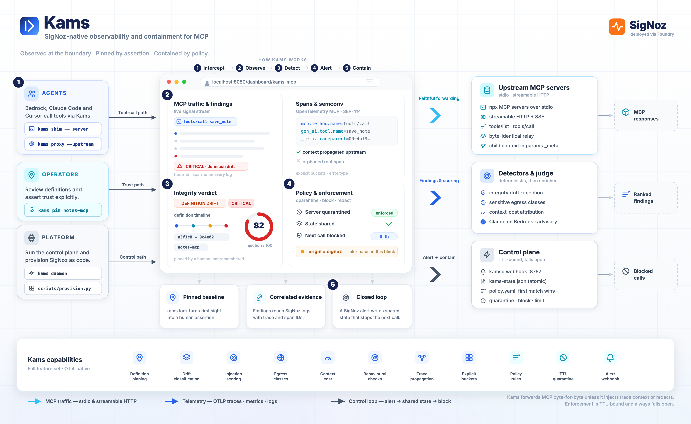
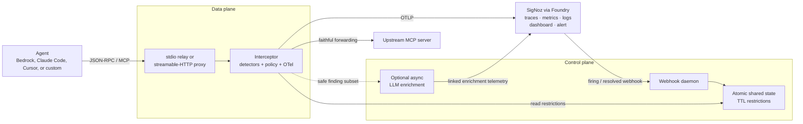
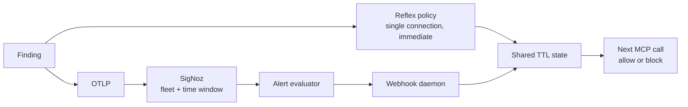

# Kams — Implemented Architecture

This document describes the code as it exists after live verification.

## 1. Runtime topology



Kams has a data plane and a control plane.



The same `Interceptor` is used by both transports. Transport adapters own I/O;
the interceptor owns correlation, detection, policy, and telemetry. This avoids
a silent security gap where a detector exists on stdio but not HTTP.

The daemon is not on the normal request path. A missing daemon or unavailable
SigNoz degrades observability and alert-driven policy updates without breaking
otherwise healthy MCP traffic.

## 2. Request and response lifecycle

```mermaid
sequenceDiagram
    participant A as Agent
    participant K as Kams
    participant U as MCP server
    participant Z as SigNoz

    A->>K: tools/call + params._meta trace context
    K->>K: extract context; open CLIENT span
    K->>K: check standing restriction
    alt already restricted
        K->>K: emit child enforcement span + metric
        K-->>A: explicit JSON-RPC policy error
    else allowed
        K->>K: inspect egress; apply deterministic policy
        K->>U: original or explicitly redacted request + child context
        U-->>K: response
        K->>K: integrity / result / cost / behaviour checks
        K-->>A: response
        K->>Z: span events + metrics + correlated log
    end
```

Request spans remain open until the matching response arrives. Correlation is
by a transport-local token plus JSON-RPC ID, not by arrival order. HTTP assigns
a distinct token to every request, so two concurrent clients may both use
`id=1` without one response closing the other's span. A missing response closes
as an error during shutdown instead of disappearing.

The original JSON bytes are forwarded unless Kams intentionally injects trace
context or applies a redaction. Golden tests prove byte identity in observation-
only mode.

## 3. Trace context and semantic conventions

Kams follows the published OpenTelemetry MCP semantic conventions and SEP-414.

Incoming W3C `traceparent`, `tracestate`, and baggage are extracted from
`params._meta`. Kams starts its MCP client span and reinjects that child context
upstream while preserving unrelated `_meta` keys.

Representative contract:

| Concern | Emission |
|---|---|
| Span names | `tools/list`, `tools/call save_note` |
| MCP identity | `mcp.method.name`, `mcp.session.id`, `mcp.protocol.version` |
| JSON-RPC | `jsonrpc.request.id`, `rpc.response.status_code` |
| Transport | `network.transport=pipe` or `tcp` |
| Tool | `gen_ai.operation.name=execute_tool`, `gen_ai.tool.name` |
| Errors | `error.type`; successful span status remains unset |
| Propagation visibility | `kams.trace.propagated` |

Kams-specific attributes remain under `kams.*`. The model file
`src/kams/semconv/mcp.yaml` proposes only context-cost attribution:
`mcp.context.cost.tokens` plus the mandatory
`mcp.context.cost.estimated` discriminator.

## 4. Detection model

Detectors return immutable, typed findings. A finding includes kind, severity,
stable detector ID, server, optional tool, safe summary, redacted evidence, and
confidence. Detectors do not decide actions.

### Integrity

`tools/list` is canonicalised per tool over `(name, description, inputSchema)`.
The store records the full baseline plus a digest:

- first sighting creates a **provisional** baseline;
- `kams pin` changes that baseline into an explicit assertion;
- later changes are classified as description drift, schema widening/narrowing,
  tool addition, or tool removal.

Only `integrity.definition_drift` increments
`mcp.integrity.drift.count`. Result-side injection and other findings increment
the generic `kams.finding.count`, preventing the critical alert from firing on
the wrong condition.

Prompt-injection scoring examines text added by a change and combines several
independent signals using noisy-OR. The policy can therefore distinguish a typo
from a pinned rewrite containing model-directed instructions.

### Egress

Arguments are inspected before forwarding. Findings contain sensitive classes,
paths, counts, and salted digests—never raw values. Policy can allow, redact, or
block according to both class and destination server.

### Context cost

The interceptor estimates result tokens from byte size and emits
`estimated=true`. The instrumented Bedrock loop records provider input-token
usage on the following turn, distributes that measured delta across pending
tool results, emits `estimated=false`, and updates a per-server calibration
factor. No currency claim is made.

### Behaviour

Sliding-window checks cover error rate, latency drift, retry storms, and thrash.
Repetition alone is not thrash: identical calls with changing results are
polling; identical calls with identical results mean the agent learned nothing.

## 5. Policy and shared state

`policy.yaml` is ordered and declarative. Supported actions are:

- allow;
- warn;
- redact arguments;
- rate-limit;
- block a tool;
- quarantine a server.

Rate limits use a real sliding window parsed from values such as `6/min`.
Restrictions carry the triggering rule, target, reason, creation time, expiry,
optional rate, and `origin`.

Shared restrictions live in a small JSON file written by atomic replace.
Readers cache for at most one second and ignore expired entries. A malformed
file fails open. The file is deliberately inspectable: it answers why a server
is blocked without a live daemon.

## 6. Dual control loop

Two paths write the same restriction shape:



The reflex path handles evidence visible in one connection. The SigNoz path can
act on aggregation across processes and time. `--no-reflex` disables new local
restrictions while continuing to honour the shared state; the live
`kams-demo-alert` proof uses it to demonstrate that SigNoz really caused the
block.

A blocked call emits an enforcement span as a child of the active MCP span.
Alert-driven enforcement occurs later and the webhook does not receive W3C
trace context, so it emits a separate correlated control-plane span and log
with `kams.enforce.origin=signoz`. Kams does not falsely assign it to the
original trace.

Resolved alerts lift matching server restrictions. Firing restrictions are
TTL-bound, preventing a flapping or abandoned alert from becoming an indefinite
outage.

## 7. Telemetry sent to SigNoz

### Traces

- one MCP CLIENT span per request/response pair;
- finding events on the active MCP span;
- child enforcement spans for in-request blocking;
- control-plane enforcement spans for SigNoz webhooks;
- agent, chat, inference, and tool-execution spans in the Bedrock demo;
- linked asynchronous enrichment spans.

### Metrics

| Metric | Purpose |
|---|---|
| `mcp.client.operation.duration` | explicit-bucket operation latency |
| `mcp.tool.call.count` | tool volume |
| `mcp.tool.error.count` | JSON-RPC tool errors |
| `mcp.integrity.drift.count` | definition-drift findings only |
| `kams.finding.count` | every finding family |
| `mcp.egress.classified.count` | sensitive classes by server/tool |
| `mcp.context.cost.tokens` | estimated or reconciled tokens |
| `kams.enforcement.count` | action, rule, and reflex/SigNoz origin |

Short-lived shims export counters with delta temporality. Duration uses explicit
buckets so p95 is meaningful at MCP latencies.

### Logs

Python logging is exported through OTLP. Finding and enforcement records emitted
inside active spans arrive with non-empty trace and span IDs. Attributes carry
safe structured dimensions; sensitive values are excluded at finding
construction time.

### Dashboard and alert

The nine-panel dashboard and critical integrity alert are versioned JSON and are
created or updated through SigNoz's own MCP server. The alert requires:

```text
severity='CRITICAL'
AND kind='INTEGRITY_DRIFT'
AND detector='integrity.definition_drift'
AND baseline_state='pinned'
```

## 8. Failure behaviour and boundaries

| Failure | Behaviour |
|---|---|
| SigNoz or OTLP unavailable | export retries/buffers then drops; MCP continues |
| Webhook daemon unavailable | no new alert-origin restriction; reflex policy remains |
| Detector or policy exception | logged and treated fail-open |
| Shared-state file unreadable | treated as empty |
| Upstream dies | protocol error/EOF reaches the client; pending span closes as error |
| No incoming trace context | valid root MCP span with propagation flag false |
| LLM enrichment unavailable | deterministic finding and action remain unchanged |

Known boundaries:

- calls already pipelined before a restriction is installed cannot be recalled;
- the demo webhook assumes a trusted network and has no signature validation;
- provider usage is turn-level, so measured cost is defensibly attributed but
  not tokenised independently per result;
- alert evaluation is intentionally slower than the reflex path.

## 9. Repository structure

```text
src/kams/
  transport/     stdio and streamable-HTTP adapters
  protocol/      JSON-RPC parsing and MCP trace propagation
  shim/          shared interception pipeline
  detect/        integrity, injection, egress, cost, behaviour
  policy/        declarative policy and sliding-window limits
  telemetry/     OTel setup and semantic constants
  daemon/        webhook, shared state, async enrichment
provisioning/    versioned SigNoz dashboard and alert
demo/            deterministic, alert-only, and Bedrock scenarios
tests/           detector, policy, telemetry-contract, and golden-wire tests
```
