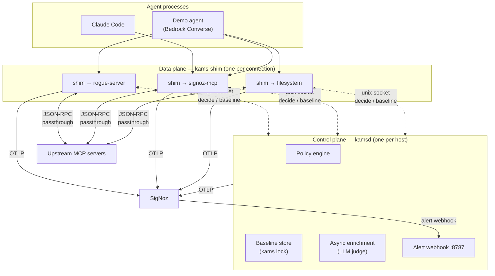
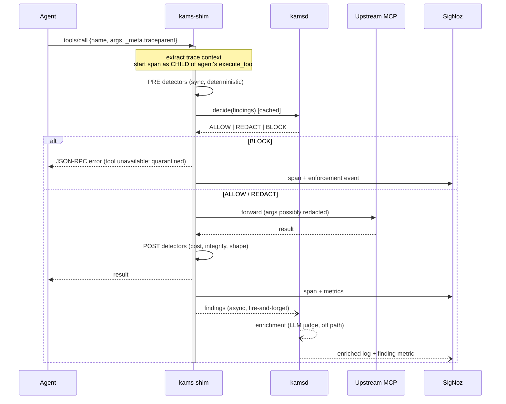
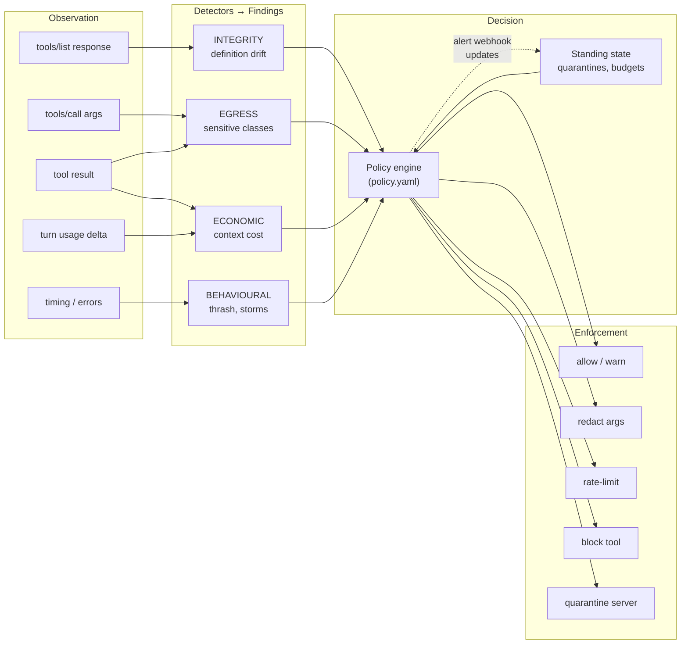
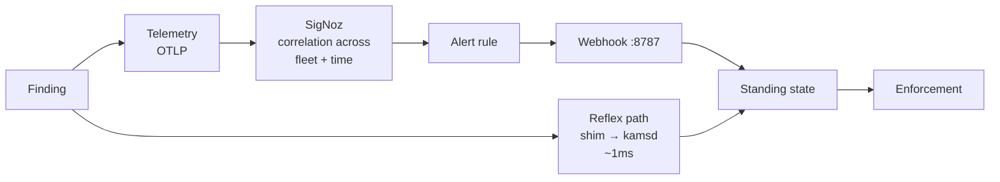

# Kams — Architecture

Companion to `plan.md`. That document says *what* and *why*; this one says *how*, and specifically how the brain works.

**Design stance:** the proxy is plumbing. The value is in the detection and decision layer. Everything below is organised so that the plumbing is boring, correct, and untouchable, and the intelligence is declarative, testable, and swappable.

---

## 0. Five principles

These resolve most design arguments before they start. When something below looks odd, it is usually one of these being enforced.

1. **Observability must never break the workload.** Telemetry failure, SigNoz being down, a detector throwing — none of these may affect what the agent sees. The interceptor is fail-open on everything except an explicit standing quarantine.
2. **No LLM in the enforcement hot path.** Enforcement must be deterministic, sub-millisecond, and reproducible in a test. LLM judgement is enrichment, computed off the critical path, and it annotates findings rather than deciding them.
3. **Detection is declarative, not hardcoded.** Detectors emit typed findings; a policy file maps findings to actions. Changing what Kams does about a threat must not require changing Kams.
4. **Never log a secret to prove a secret leaked.** Egress detection records class, count, position, and a salted digest. Never the value. A tool that exfiltrates data into your observability backend is not an improvement.
5. **Degrade, don't disappear.** Missing trace context, an uncooperative agent, an unknown transport — each drops one capability and keeps the rest. Nothing in the design requires the agent to cooperate.

---

## 1. Topology: why two processes

MCP's stdio transport means the *client spawns the server as a subprocess*. To intercept, Kams must be the thing the agent spawns. That gives one interceptor process per agent↔server connection, which collides with three requirements:

- A quarantine decision must apply to **every** connection to that server, not just the one that saw the problem.
- Tool-definition baselines must persist **across** sessions — that is what makes drift detection meaningful.
- SigNoz alert webhooks need **one** stable endpoint, not one per subprocess.

So Kams splits along the standard control-plane/data-plane line:



| | `kams-shim` (data plane) | `kamsd` (control plane) |
|---|---|---|
| Lifetime | One per connection, dies with it | Long-lived, one per host |
| Job | Faithful JSON-RPC relay, span emission, **synchronous** detectors | Baselines, policy state, **async** detectors, webhook, enrichment |
| Latency budget | Microseconds — it is in the request path | Irrelevant — off the path |
| If it crashes | That one connection dies | Shims fail **open** and keep working with last-known policy |

The shim caches policy state in-process and refreshes on a short interval plus on push. A `kamsd` outage therefore degrades to "enforcement is stale" rather than "the agent stops working" — principle 1.

**HTTP transport** uses the same interceptor as a reverse proxy instead of a subprocess wrapper — same detector pipeline, same policy, different I/O adapter, since the transport is deliberately kept out of the brain. Both adapters build their pipeline through one shared factory, so a detector cannot be wired into one and silently missing from the other.

---

## 2. The request lifecycle



The critical property: **the agent's latency includes only the sync detectors and a cached policy lookup.** Everything expensive is after the response, or in another process.

---

## 3. The brain

Three stages, deliberately separated so each is independently testable: **Detectors** produce findings → **Policy** maps findings to actions → **Enforcement** applies them.



### 3.1 The finding

Every detector emits the same shape. This uniformity is what lets the policy engine stay dumb and declarative.

```python
@dataclass(frozen=True)
class Finding:
    kind: FindingKind          # INTEGRITY_DRIFT, EGRESS_SENSITIVE, COST_SPIKE, ...
    severity: Severity         # INFO | LOW | MEDIUM | HIGH | CRITICAL
    server: str                # logical upstream name
    tool: str | None
    detector: str              # stable id, e.g. "integrity.description_delta"
    summary: str               # human-readable, safe to log
    evidence: dict             # structured, PRE-REDACTED — never raw values
    confidence: float          # 0..1 — heuristics are not certainties
    trace_id: str
    span_id: str
```

`evidence` is redacted **at construction**, not at logging time. A detector that cannot describe its finding without quoting a secret must describe it with a digest instead. This is enforced by a test asserting no finding's serialised form matches the known-secret fixtures.

### 3.2 INTEGRITY — the supply-chain detector

This is the differentiator, so it gets the most design.

**Naive approach, rejected:** hash the whole `tools/list` response. Servers legitimately reorder tools, add tools, and bump versions; a whole-response hash fires constantly and gets ignored. An alert everyone mutes is worse than no alert.

**Actual approach — structured, per-tool, typed deltas.**

For each tool, compute a digest over a canonicalised triple: `(name, description, inputSchema)` — schema keys sorted, whitespace normalised, so formatting churn doesn't fire. Compare against baseline and classify the change:

| Change class | Default severity | Reasoning |
|---|---|---|
| `DESCRIPTION_CHANGED` | **HIGH** | **The tool-poisoning vector.** Descriptions are injected verbatim into the model's context. This is the one that matters. |
| `SCHEMA_WIDENED` | MEDIUM | New/loosened params — more surface for data to leave through |
| `TOOL_ADDED` | MEDIUM | New capability appearing mid-session was not in anyone's threat model |
| `SCHEMA_NARROWED` | LOW | Usually a genuine fix |
| `TOOL_REMOVED` | LOW | Availability problem, not a security one |

**Trust on first use, then pin.** First observation of a server writes a provisional baseline. `kams pin` promotes provisional baselines to `kams.lock` — a committed lockfile of tool definitions, exactly analogous to a dependency lockfile. After pinning, *any* deviation is a finding. This reframes MCP servers as what they are: **third-party dependencies that currently ship with no integrity checking at all.**

**Description-delta analysis.** "Changed" is not enough — we need to say *how alarming*. Deterministic heuristics, scored and combined, no LLM:

- **Imperative injection** — new imperative constructions aimed at the model ("ignore", "instead of", "always call", "do not tell", "before responding")
- **Exfiltration shape** — new URLs, email addresses, or instructions to forward/send/POST content
- **Cross-tool reference** — a description that starts talking about *other* tools, a known multi-tool poisoning pattern
- **Invisible payload** — zero-width characters, bidi overrides, private-use codepoints, homoglyph substitution. Real vector, trivially detected, and almost nobody checks.
- **Encoded blobs** — base64/hex runs above a length and entropy threshold
- **Magnitude** — normalised edit distance, so a typo fix scores differently from a rewrite

Each contributes to a 0..1 score, mapped to severity by thresholds in `policy.yaml`. Scores and thresholds are visible and tunable; the detector explains which signals fired, so a human reading the SigNoz log sees *why*, not just *that*.

**Then — and only then — the LLM judge.** `kamsd` asynchronously sends the *description diff* (never arguments, never results) to Sonnet 4.6 for a natural-language assessment, attached to the finding as enrichment. It **cannot** change the severity or the action. Per principle 2: enforcement stays deterministic, and the demo cannot be derailed by a model having an off moment. The judge makes the log readable; the heuristics make the decision.

### 3.3 EGRESS — what is leaving, and to whom

Runs over `tools/call` arguments before forwarding, and over results coming back.

Detectors: high-entropy strings, credential shapes (AWS keys, private-key armour, JWTs, bearer tokens), PII shapes (email, phone, card-like runs), and **volume anomaly** — a tool whose argument payload jumps far above its own established baseline.

Output records class, count, JSON path, and a salted digest for cross-call correlation. Never the value (principle 4). The salt is per-installation, so digests correlate locally and mean nothing if the telemetry leaves.

The interesting policy primitive is the pairing: *this class of data* going to *this server*. `secrets → any third-party server` is CRITICAL; `email addresses → the CRM server` is expected and boring. Sensitivity is a property of the pair, not the payload.

### 3.4 ECONOMIC — context cost, measured rather than guessed

Tool results consume context tokens, and today nobody attributes that cost to the server responsible.

**Estimation, rejected as the only method:** we have no access to the exact tokenizer, so character heuristics drift.

**Actual approach — two-tier, with reconciliation.** Per call, a cheap estimate for immediate attribution. But the agent's Converse response reports `usage.inputTokens` for the turn, and we know exactly which tool results entered context between turn *N* and *N+1*. So `kamsd` **reconciles**: distribute the measured input-token delta across contributing results in proportion to estimate, and carry a running per-server correction factor that sharpens the estimate over time.

The result is ground truth at turn granularity and a calibrated estimate at call granularity — not a guess dressed up as a metric. Cost in currency is derived from the measured tokens and a per-model rate table, so the dashboard shows money attributed to the MCP server that caused it. As far as I can find, nothing else does this.

### 3.5 BEHAVIOURAL — reliability and thrash

Sliding-window detectors: error-rate breach per server/tool, latency degradation against the server's own baseline, retry storms, and **thrash** — the same tool called with semantically identical arguments repeatedly inside one conversation, which is the signature of an agent stuck in a loop burning tokens.

### 3.6 Policy: declarative, ordered, explainable

```yaml
version: 1
defaults:
  action: allow
  fail_mode: open           # principle 1

thresholds:
  integrity.description_delta:
    high: 0.55
    medium: 0.30

rules:
  - name: quarantine-on-poisoned-description
    match: { kind: INTEGRITY_DRIFT, detector: integrity.description_delta, severity: [HIGH, CRITICAL] }
    action: quarantine_server
    ttl: 1h
    reason: "Tool description changed mid-session in a way consistent with prompt injection"

  - name: block-secret-egress
    match: { kind: EGRESS_SENSITIVE, classes: [aws_key, private_key, jwt] }
    unless: { server: [vault-mcp] }
    action: block_tool

  - name: redact-pii-to-untrusted
    match: { kind: EGRESS_SENSITIVE, classes: [email, phone] }
    unless: { server: [crm-mcp] }
    action: redact_args

  - name: throttle-cost-runaway
    match: { kind: COST_SPIKE, severity: [HIGH] }
    action: rate_limit
    rate: 6/min
```

First match wins; evaluation order is the file order. Every decision emits **which rule fired**, so the enforcement span answers "why did this happen" without anyone reading source. An unmatched finding is still recorded — observation and enforcement are separate concerns, and Kams is useful in pure-observation mode with an empty ruleset.

### 3.7 Enforcement points

| Action | Applied | Agent sees |
|---|---|---|
| `allow` | — | Nothing |
| `warn` | — | Nothing; finding recorded |
| `redact_args` | Pre-forward | Call succeeds, sensitive spans replaced with typed placeholders |
| `rate_limit` | Pre-forward | Normal until budget exceeded, then a retryable JSON-RPC error |
| `block_tool` | Pre-forward | JSON-RPC error naming the tool and the reason |
| `quarantine_server` | Connection-level | All tools on that server error out; standing state in `kamsd` |

Quarantine is the only fail-**closed** state, and it is always explicit, always TTL'd, and always attributable to a named rule.

---

## 4. The dual control loop

Two paths into the same policy engine. This is a real architectural claim, not a demo contrivance.



**Why both, precisely:** the shim sees *one connection, right now*. SigNoz sees *every agent, every server, over time*. Conditions like "this server's error rate across all agents exceeded 20% over five minutes" or "aggregate context cost for this conversation crossed budget" are **not expressible in the shim** — it doesn't have the data. That is the honest justification for routing enforcement through SigNoz: it is not a detour to satisfy a hackathon requirement, it is the only component that can see fleet-scale, time-windowed conditions.

So: the reflex path handles what one connection can determine alone (a poisoned description is visible immediately). The SigNoz path handles what only the aggregate knows.

**The enforcement span is the payoff.** When the webhook fires, `kamsd` emits a span linked — via OTel span links — to the span that triggered the alert. In the SigNoz waterfall you see the poisoned call, and then the containment, in the same trace. That is the demo, and it exists because of this loop rather than in spite of it.

---

## 5. Trace context over MCP — an unsolved problem we have to solve

**MCP has no defined mechanism for propagating trace context.** No headers in stdio. Without propagation, Kams' spans are disconnected roots and "one trace, start to finish" collapses.

**Our approach:** W3C `traceparent` in the JSON-RPC `params._meta` object, which the MCP spec reserves for exactly this kind of out-of-band metadata.

```jsonc
{
  "jsonrpc": "2.0", "id": 7, "method": "tools/call",
  "params": {
    "name": "read_file",
    "arguments": { "path": "/etc/hosts" },
    "_meta": {
      "traceparent": "00-4bf92f3577b34da6a3ce929d0e0e4736-00f067aa0ba902b7-01"
    }
  }
}
```

Our demo agent injects it. Third-party agents (Claude Code, Cursor) do not, so Kams **degrades**: spans become roots, correlated by session id and wall-clock, and a `kams.trace.orphaned=true` attribute marks them so the gap is visible rather than silent. Every capability except cross-process trace nesting survives (principle 5).

`_meta` is stripped before forwarding upstream unless the upstream advertises support, so instrumentation never changes what the server receives.

**This goes in the semconv contribution.** Trace propagation over MCP needs a convention, the spec doesn't have one, and shipping a working implementation alongside the proposal is a stronger argument than the proposal alone.

---

## 6. Telemetry model

Spans, metrics, and logs as specified in `plan.md` §4. Two additions the brain requires:

**Enforcement spans** — `kams.enforce {action}`, carrying `kams.rule.name`, `kams.finding.kind`, `kams.finding.severity`, `kams.finding.confidence`, `kams.enforce.ttl`, plus an OTel **span link** to the triggering span.

**Finding events** — findings ride as span events on the MCP span when synchronous, and as correlated logs when produced asynchronously by `kamsd`.

Resource attributes distinguish the two planes (`service.name = kams-shim` / `kamsd`) so SigNoz can separate data-plane throughput from control-plane activity.

---

## 7. Repo layout

```
kams/
├── casting.yaml / casting.yaml.lock   # Foundry — rules requirement
├── policy.yaml                        # declarative rules
├── kams.lock                          # pinned tool-definition baselines
├── src/kams/
│   ├── transport/     # stdio.py, http.py — I/O adapters, no logic
│   ├── protocol/      # JSON-RPC framing, MCP message types, _meta handling
│   ├── shim/          # data plane: relay + sync detectors + spans
│   ├── daemon/        # control plane: policy state, webhook, enrichment
│   ├── detect/        # integrity.py, egress.py, economic.py, behavioural.py
│   ├── policy/        # parser + evaluator (pure, no I/O)
│   ├── telemetry/     # spans, metrics, logs, semconv constants
│   └── semconv/       # mcp.yaml — the upstream-able model file
├── provisioning/      # dashboards + alerts as versioned JSON
├── demo/              # Bedrock agent, rogue MCP server, scenario driver
└── tests/
    ├── golden/        # transparency: identical transcripts with/without Kams
    ├── detect/        # detector unit tests incl. the no-secrets-in-findings assertion
    └── policy/        # rule evaluation table tests
```

`detect/` and `policy/` are **pure** — no I/O, no network, no clock reads except injected. That is what makes the brain testable, and it is why the detectors can be exercised without Docker, SigNoz, or Bedrock.

---

## 8. Failure modes

| Failure | Behaviour | Principle |
|---|---|---|
| SigNoz unreachable | Spans buffered then dropped; agent unaffected | 1 |
| `kamsd` down | Shims use cached policy; new baselines provisional | 1 |
| Detector raises | Caught, logged as `kams.detector.error`, treated as no finding | 1 |
| Upstream MCP server dies | Error relayed faithfully to the agent | — |
| No trace context | Root spans, `kams.trace.orphaned=true` | 5 |
| Unknown JSON-RPC method | Relayed verbatim, generic span | 5 |
| LLM judge unavailable | Finding ships without enrichment; severity unchanged | 2 |

The golden-transcript test is the load-bearing guarantee: byte-identical JSON-RPC exchanges with and without Kams in the path, for every method, including error cases. If that test fails, nothing else matters.

---

## 9. Deliberately out of scope

Stated so the demo's boundaries are honest rather than discovered by a judge:

- **Not an authorization system.** Kams observes and contains; it does not manage identity or permissions.
- **No result-content rewriting** beyond redaction. Silently altering tool results would corrupt agent behaviour in ways nobody could debug.
- **Sampling is all-or-nothing per server.** Adaptive sampling is real work and irrelevant at demo scale.
- **The LLM judge never decides.** Worth repeating as a scope boundary, not just a principle.

---

## 10. Build order, revised

Dependency-ordered so each stage is demonstrable on its own.

| Stage | Ships | Proves |
|---|---|---|
| 1 | `transport/` + `protocol/` + golden tests | Transparency — the non-negotiable |
| 2 | `telemetry/` + `_meta` propagation | Traces nesting correctly in SigNoz |
| 3 | `detect/integrity` + `kams.lock` + pinning | The differentiating detector |
| 4 | `policy/` + shim enforcement (reflex path) | Deterministic containment |
| 5 | `daemon/` + webhook (SigNoz path) | The closed loop and enforcement spans |
| 6 | `detect/egress` + `detect/economic` | Breadth across all four signal families |
| 7 | `provisioning/` + `demo/` | The narrative |

Stages 1–2 carry rules compliance. Stages 3–5 carry the differentiation. Stage 6 is the first honest cut point if time runs short: with egress and economic dropped, Kams is still a coherent, complete story about MCP supply-chain integrity.

---

*Written Jul 25, 2026, before implementation. Revise it when reality disagrees — and say so in the commit.*
